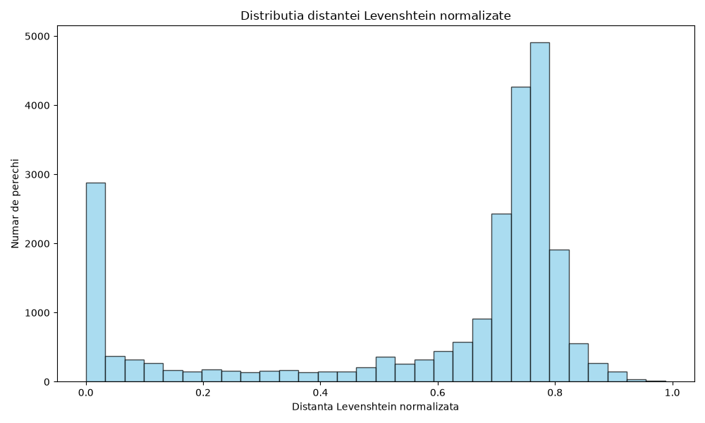
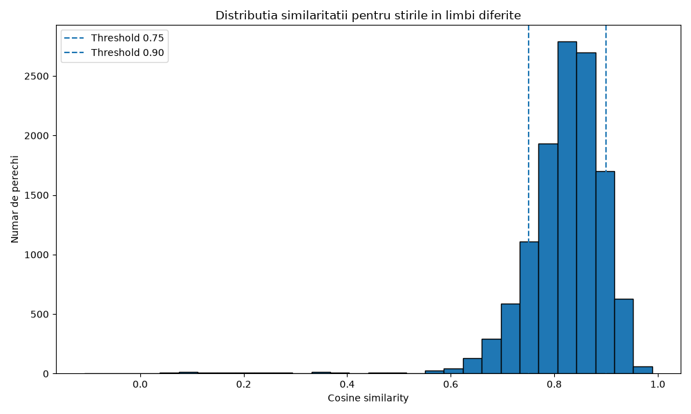
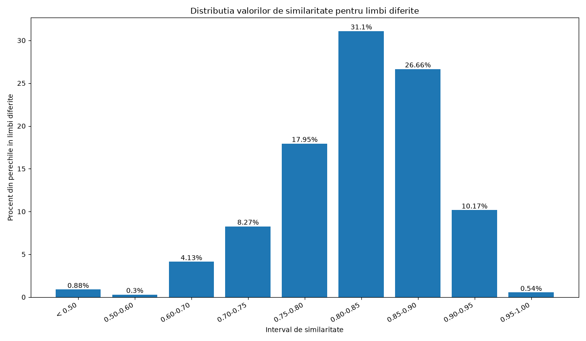
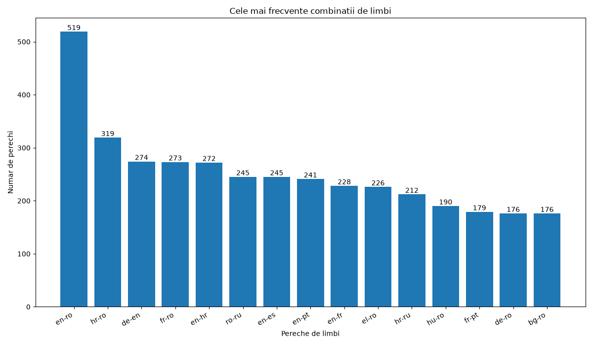
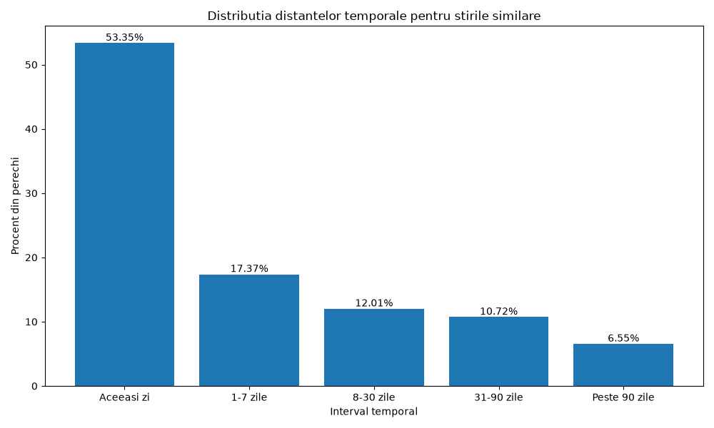

# Dataset Cleaning

Before performing the similarity analysis, the dataset was cleaned to remove invalid articles.

An article was considered invalid when:

*   **High Corruption Index:** The proportion of Unicode replacement characters (`�`) exceeds a predefined threshold ($\tau = 10\%$);
*   **Boilerplate/Source Code Contamination:** The content contains script remnants (e.g., JavaScript fragments, tracking parameters, or advertisement injection tokens) rather than prose.
*   **Missing or Corrupted Payloads:** The document body consists exclusively of an external video reference or metadata link.
*   **Null Representations:** Both the title and body text fields evaluate to null or empty strings.

> **Handling Asymmetry:** If a document body is empty but its corresponding title remains structurally valid, the title is promoted to act as the primary textual representation for downstream tasks. To preserve pair integrity, if either document in a paired sample $(d_1, d_2)$ is flagged as invalid, the entire pair is pruned from the dataset.

### Cleaning results

```text
Invalid articles: 813
Initial pairs: 100000
Removed pairs: 449
Remaining pairs: 99551
```

*Methodological Note:* A primary challenge identified during language classification via `langdetect` was the systematic misclassification of heavily corrupted text payloads (dominated by  characters) as Bengali (`bn`), rather than generating an `unknown` or low-confidence exception.
For `langdetect`, an `unknown` language was the lack of information, for instance no context, spaces or \n or \t. Although, there were some articles that had no context (so detected as unknown language), the title could have given us enough information in order to continue our research on the provieded dataset. Another problem was that there were some articles that only had a link to a video or some JavaScript code that we couldn't have processed as NLP, and we have decided to drop them out from our database.

# News Similarity Analysis

## Overview

This project analyzes multilingual news pairs classified as similar.

The analysis focuses on:

- textual similarity for articles written in the same language;
- semantic similarity for articles written in different languages;
- the most frequent language combinations;
- the temporal distance between similar news articles.

## Same-Language Similarity

For articles written in the same language, textual similarity was measured using normalized Levenshtein distance.

The distance is calculated as:

```python
edit_distance = Levenshtein.distance(content1, content2)
normalized_edit_distance = edit_distance / max(len(content1), len(content2))
```

A value close to `0` indicates nearly identical texts, while a value close to `1` indicates substantial textual differences.

The following operational categories were used:

| Normalized distance | Category |
|---:|---|
| `0.00–0.05` | `trivial_duplicate` |
| `0.05–0.20` | `near_duplicate` |
| `> 0.20` | `different_news_same_event` |

These categories describe surface-level similarity. Levenshtein distance does not directly measure semantic equivalence.

## Normalized Levenshtein Distance Distribution



The distribution contains two major regions.

The first region is concentrated close to `0`. These pairs are likely to represent:

- exact duplicates;
- syndicated content;
- minimally edited copies;
- articles differing only through formatting or punctuation.

The second and larger region is concentrated approximately around `0.70–0.80`.

This indicates that many pairs labeled as similar are lexically and structurally different, despite being related at the event level. These articles may contain:

- different wording;
- different paragraph organization;
- additional contextual information;
- different quotations;
- distinct journalistic framing.

The shape of the distribution suggests that the `Yes` class contains at least two different phenomena:

1. direct textual duplication;
2. semantic relatedness without strong lexical overlap.

Therefore, normalized Levenshtein distance is suitable for duplicate detection, but it is insufficient as a general measure of news-event similarity.


## Cross-Language Semantic Similarity

For articles written in different languages, multilingual sentence embeddings were generated using:

```text
sentence-transformers/paraphrase-multilingual-MiniLM-L12-v2
```

The semantic representations were compared using cosine similarity.

```python
embedding1 = model.encode(content1, convert_to_tensor=True)
embedding2 = model.encode(content2, convert_to_tensor=True)

multilingual_similarity = cos_sim(embedding1, embedding2).item()
```

The following operational thresholds were used:

| Cosine similarity | Category |
|---:|---|
| `< 0.75` | `different_cross_language_news` |
| `0.75–0.90` | `similar_cross_language_news` |
| `>= 0.90` | `possible_literal_translation` |

These thresholds are analytical decisions rather than empirically discovered boundaries.


## Multilingual Similarity Distribution

For articles written in different languages, multilingual embeddings and cosine similarity were used.



The distribution is strongly concentrated between `0.75` and `0.90`, indicating that most cross-language pairs classified as similar share substantial semantic content.

A smaller but relevant group exceeds `0.90`, representing very high semantic similarity.

The thresholds used in the analysis are:

- below `0.75`: `different_cross_language_news`;
- between `0.75` and `0.90`: `similar_cross_language_news`;
- at least `0.90`: `possible_literal_translation`.

However, a score above `0.90` does not necessarily prove that one article is a literal translation of the other. It only indicates very high semantic similarity.


## Cross-Language Similarity Intervals

The similarity scores were also divided into intervals.



Most values are concentrated in the following intervals:

- `31.10%` between `0.80` and `0.85`;
- `26.66%` between `0.85` and `0.90`;
- `17.95%` between `0.75` and `0.80`;
- `10.17%` between `0.90` and `0.95`.

Only a small percentage of pairs have similarity scores below `0.60` or above `0.95`.

The largest group, representing `31.10%` of the cross-language pairs, has similarity scores between `0.80` and `0.85`.

These pairs are generally semantically close and are likely to describe the same event or strongly related information. They usually share the main facts, actors and topic, but may differ in wording, additional details, emphasis, or article structure.

Therefore, this interval indicates high semantic similarity, but not necessarily literal translation or identical content.


## Most Frequent Language Combinations

The following graph shows the most frequent language combinations among cross-language pairs.



The most frequent combination is `en-ro`, with `519` pairs, followed by `hr-ro`, with `319` pairs.

Other frequent combinations include:

- `de-en`;
- `fr-ro`;
- `en-hr`;
- `ro-ru`;
- `en-es`;
- `en-pt`;
- `en-fr`.

Romanian appears in many of the most frequent combinations. This means that the multilingual analysis is influenced more strongly by language pairs that include Romanian.

The dataset is not equally balanced across all language combinations, so this should be considered when interpreting the overall results.


## Temporal Distance Distribution

The temporal distance was calculated for all article pairs classified as similar.



The results are:

- `53.35%` were published on the same day;
- `17.37%` were published within 1–7 days;
- `12.01%` were published within 8–30 days;
- `10.72%` were published within 31–90 days;
- `6.55%` were published more than 90 days apart.

More than `70%` of the similar pairs were published within one week.

This suggests that temporal proximity is strongly associated with news similarity.

Pairs separated by more than 90 days may represent:

- retrospective articles;
- recurring events;
- reused content;


## Extreme Similarity Pairs

Evaluating extreme similarity instances exposes critical edge cases and systemic limitations within standard NLP tracking baselines:

### Case Alpha: The False Cross-Lingual Positive (Maximum Similarity Score)
*   **Cosine Score:** $0.9893$ | **Temporal Delta:** $\approx 0.17\text{ days}$
*   **Linguistic Mapping Failure:** Classified by the pipeline as a cross-lingual pair (Croatian `hr` vs. Macedonian `mk`).
*   **Diagnostic Inspection:** Human-in-the-loop validation revealed the documents were identical Serbian texts, with one rendered in Latin script and the other transliterated into Cyrillic. The off-the-shelf language identifier failed to recognize the orthographic shift, mistakenly attributing the script change to a language change. The near-perfect embedding score reflects script invariance rather than exceptional cross-lingual translation modeling.

### Case Beta: The Structural Noise Outlier (Minimum Similarity Score)
*   **Cosine Score:** $-0.1083$ | **Temporal Delta:** $\approx 101.70\text{ days}$
*   **Linguistic Mapping:** French (`fr`) vs. Romanian (`ro`).
*   **Diagnostic Inspection:** While both documents share a baseline semantic entity (e.g., "Donald Trump/Harvard University"), severe format discrepancies led to an artificial drop in vector alignment. Document $d_1$ was an compressed, abstract summary, while document $d_2$ suffered from uncleaned HTML boilerplate, styling elements, and WordPress metadata injections. This demonstrates that document-level pooling remains highly sensitive to uncleaned structural noise.

---

detectăm limba articolului cu langdetect, folosim tokenizerul NLTK corespunzător atunci când limba este suportată, iar pentru celelalte limbi folosim fallback cu regex.

Asta este mai corect metodologic decât să aplicăm tokenizerul implicit de engleză tuturor limbilor.